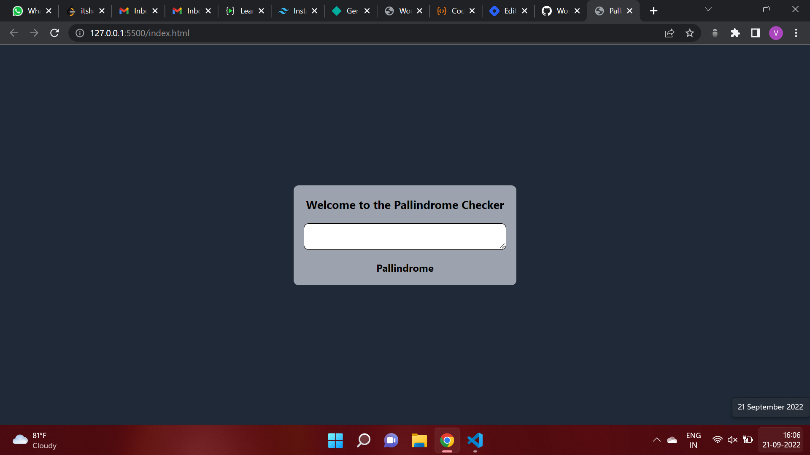

# **Palindrome Checker App**
## **Overview**
This is a simple pallindrome checker app in which a user can enter a number or string to check that. Pallindrome are the string or number which are same from back and forth which means we will read that string as same from starting side and from end side. For eg. "121", this will be "121" from front and "121" from back also.

## **Technology Used**
1. HTML
2. Tailwind CSS
3. JavaScript

## **Output**

## **Live Link**
